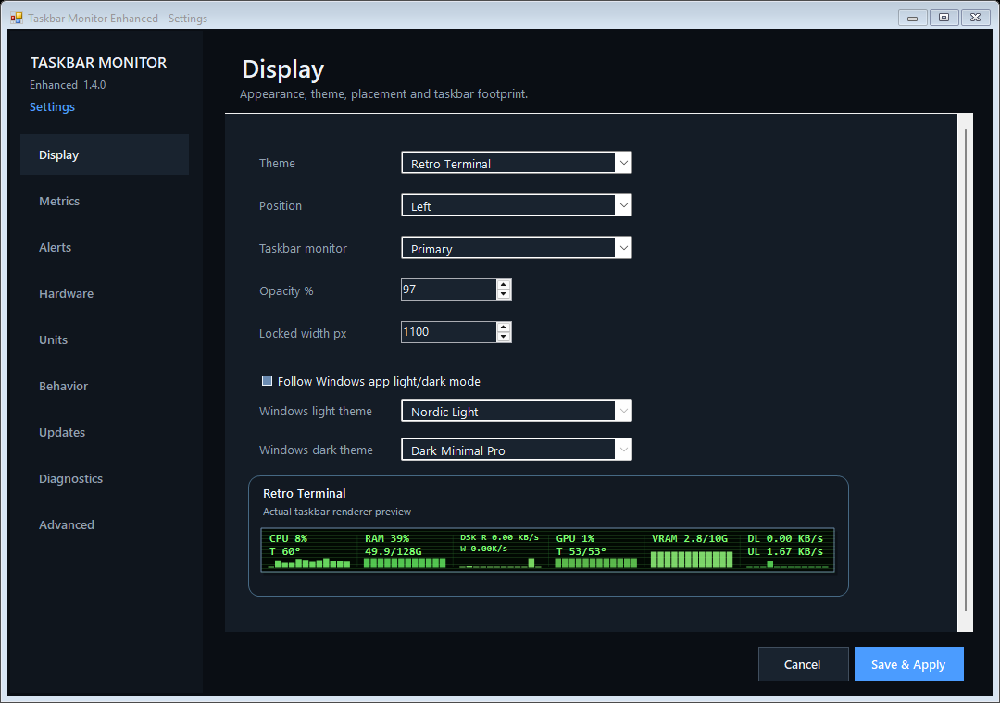

# Taskbar Monitor Enhanced

A lightweight Windows taskbar system monitor for live CPU, RAM, disk, network, GPU, VRAM and temperature telemetry.

## v1.3.1 — Real Theme Preview

**v1.3.1 is the current public Latest release.** It is a focused UI patch on the immutable v1.3.0 reliability release.

The Display page now shows the selected theme as a **real taskbar sample** instead of a palette mock:

- same renderer pipeline as the live monitor: `PaintBackground -> BuildMetricViews -> PaintMetric`
- real 48 px taskbar strip
- live current metrics and existing sparkline history in the running application
- immediate redraw when the selected theme changes
- off-screen rendering no longer resizes or moves the live taskbar OverlayForm
- Settings proof records `ThemePreview=ACTUAL_TASKBAR_RENDERER`, `ThemePreviewNoSyntheticMetricData=true`, and 12 live samples

The protected sensor layer is unchanged:

- Broker protocol: `1.1.2+r21`
- Sensor Supervisor: `1.3.0+r33`
- R21 process isolation retained

## Validation

v1.3.1 passed:

- 0-warning / 0-error build and Setup verify 19/19
- built-in self-test with `REAL_THEME_PREVIEW=TRUE`
- 9/9 Settings proof using the actual taskbar renderer
- live 12-sample, no-synthetic-data theme preview proof
- visual inspection of the installed Display page
- 28/28 theme regression
- 592/500 compact regression with zero overflow
- hover, health and shell regression
- deterministic clean-clone build
- live install on Emad-PC-Ultimate
- exact healthy sensor-layer reuse without sensor version changes
- exact-head GitHub Actions CI success
- 4/4 local/CI binary hash equality
- provenance and Setup SBOM attestations
- immutable GitHub Release with 7/7 asset digest verification

## Download

Official immutable release:

https://github.com/GOD13emad/TaskbarMonitorEnhanced/releases/tag/v1.3.1

Installer SHA-256:

`67cc88d429ffa9e8d17609ecf8814cf6abf2c70979b10bb1840071a1ac5fdf26`

See [DOWNLOAD.md](DOWNLOAD.md), [v1.3.1 release notes](docs/releases/v1.3.1/RELEASE_NOTES.md), [public acceptance](docs/acceptance/v1.3.1/PUBLIC_RELEASE_ACCEPTANCE.json), [CODE_SIGNING.md](CODE_SIGNING.md) and [PRIVACY.md](PRIVACY.md).

## Core capabilities

- CPU, RAM, disk, GPU, VRAM, network and temperature monitoring
- 28 built-in themes and live sparklines
- 9-page modern Settings
- configurable CPU/GPU/disk temperature alerts
- multi-device selection and aggregation
- adaptive battery polling and Session Pause/Resume
- Copy Diagnostics and privacy-hardened Support ZIP
- safe reset-to-defaults with backup-first behavior
- left/center/right taskbar placement and compact layouts
- automatic Explorer/taskbar recovery
- continuous Start-with-Windows self-heal
- non-elevated Main with protected process-isolated hardware sensors
- deterministic builds, SBOM/provenance and immutable release verification

## Release integrity

v1.3.1, v1.3.0 and all earlier public releases are immutable. No historical tag or asset is overwritten.

Public trusted Authenticode signing remains pending an external provider; no trusted-signature claim is made.

## Project authorship

**Lead Developer & Maintainer:** Dr. Ali-Akbar Emadeddin  
GitHub: `GOD13emad`

Derived from the GPL-licensed `leandrosa81/taskbar-monitor` project with upstream attribution preserved.

## License

GNU General Public License v3.0.
