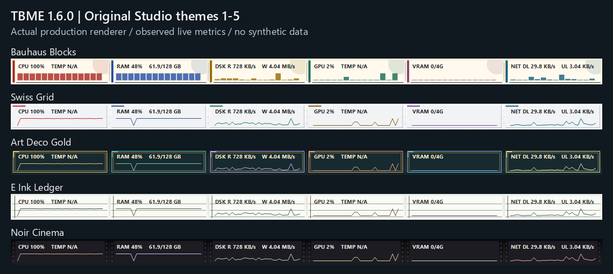
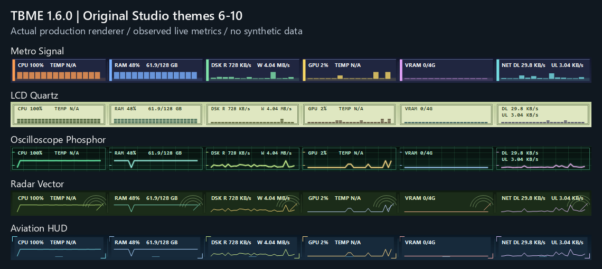
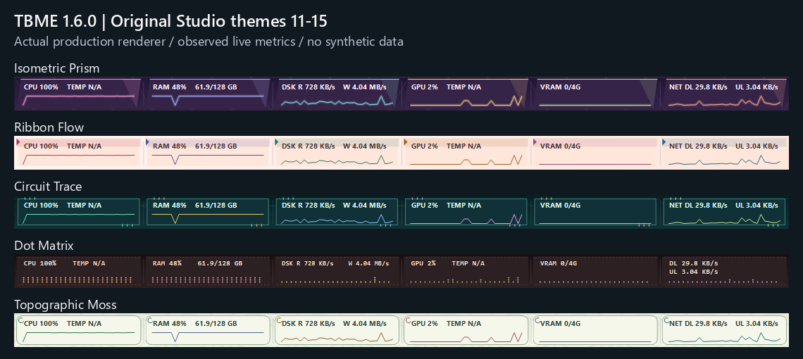
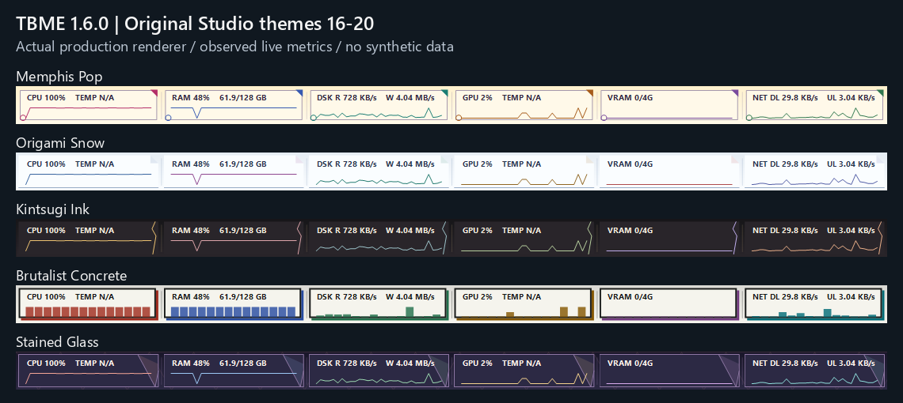
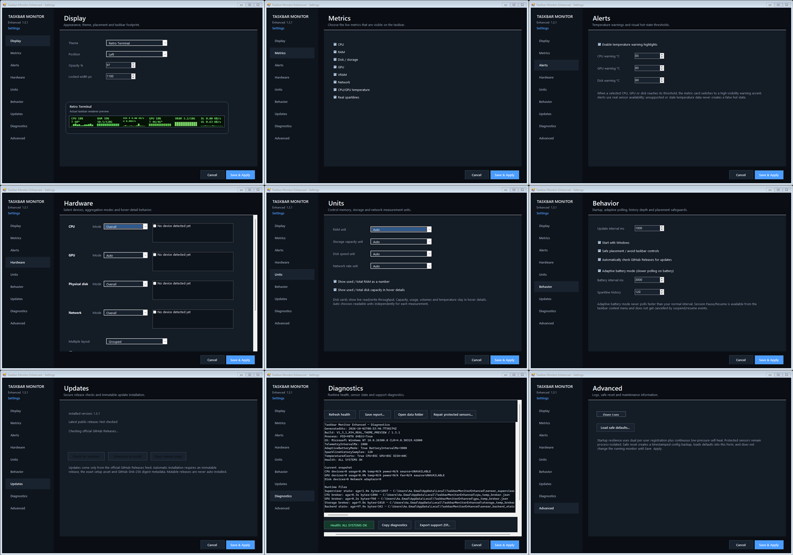

# Taskbar Monitor Enhanced

A Windows taskbar system monitor for live CPU, RAM, disk, network, GPU, VRAM and temperature telemetry.

## v1.6.0 — Performance Workspace & Theme Studio (candidate)

The current candidate adds an eight-page workspace: **Overview, Processes, Network, Storage, Alerts, Themes, Profiles and Hardware**. Public authority remains the immutable v1.5.0 release until the v1.6 publication gates are recorded as closed.

**48 built-in themes** include twenty original Studio designs. An identical-palette/font/data rendering test produces twenty distinct geometry fingerprints. Search, favorites, light/dark filters and the actual taskbar renderer are available in Theme Studio.

The workspace provides bounded session charts, min/max/average/P95, CSV/PNG/JSON exports, read-only process inspection, per-adapter network traffic, opt-in 90-day local accounting, sustained usage/capacity alerts, quiet hours/snooze, safe presentation profiles, real taskbar metric ordering, and exportable hardware inventory from the existing isolated sensor snapshot. No cloud upload is introduced and traffic persistence defaults off.

### The twenty new themes — actual renderer captures

### Current verification scope

Application compilation and the legacy/feature/workspace contract suites passed after repairing migration, runtime connections, unavailable-data handling and source-integrity defects. A live-data UI proof passed **16 actual interface-action checks**, with **58 interactive controls / zero accessible-name gaps**, and rendered all eight pages at normal and minimum window sizes. New-theme primary text contrast is tested.

The current release gates, exact revisions and failure history are tracked in [R37 verification](docs/project-control/R37_VERIFICATION.md). The [primary-source capability map](docs/project-control/R37_BENCHMARK.md) identifies implemented, partial and deferred comparisons; this product is not represented as a universal replacement for every specialist monitoring tool.

Only fresh exact-revision determinism, CI/provenance, installed-runtime validation and published digest evidence can mark this candidate Released/Final. The old pre-integration seven-page proof and zero-length-theme source commit are not acceptance evidence for the current candidate.

## v1.5.0 — Actionable Alerts & Session Export

**v1.5.0 is the current public Latest release.** It builds on immutable v1.4.0 with a narrow Main/UI product-completion change set:

- optional rate-limited Windows notifications for CPU/GPU/disk temperature thresholds
- 3 °C recovery hysteresis and 10-minute per-lane notification cooldown
- notification click-through to the Alerts settings page
- bounded 3,600-sample in-memory session telemetry with explicit CSV export
- quick **Open Task Manager** context action
- protected Broker/Supervisor binaries unchanged

### v1.5.0 validation

- build: **0 warnings / 0 errors**
- reproducible build and clean-clone determinism **PASS**
- candidate suite **11/11 PASS**
- installed/postinstall suite **11/11 PASS**
- installed binary equality **5/5 exact**
- config migration preservation **PASS**
- release-branch and main CI **PASS on the exact release SHA**
- binary provenance, runtime-config provenance and Setup SBOM attestation **PASS**
- immutable GitHub Release with **7/7 asset digest verification**

## v1.4.0 — Windows Integration & Accessibility (previous immutable release)

v1.4.0 remains an immutable previous public release. It built on v1.3.1 and focused on Windows integration, accessibility and security hardening.

### New in v1.4.0

- **PerMonitorV2 DPI awareness** through the deployed .NET Framework 4.8 WinForms runtime configuration.
- **Taskbar display selection** supports the primary taskbar and discovered secondary Windows taskbars, with safe fallback to primary if a configured target disappears.
- **Follow Windows light/dark mode** maps Windows appearance to any two built-in TBME themes and reacts to user-preference changes without restart.
- **High Contrast support** uses Windows system colors.
- Settings interactive controls expose accessible names/descriptions; **Ctrl+1…Ctrl+9**, **Ctrl+S** and **F5** provide keyboard shortcuts.
- Automatic updates now require canonical repository release/tag/installer URLs, reject draft/prerelease metadata, reject reparse-point installers, and **re-hash SHA-256 immediately before launch**.
- Process DLL lookup is hardened with `SetDefaultDllDirectories(LOAD_LIBRARY_SEARCH_DEFAULT_DIRS)`.
- Privacy-safe local crash snapshots are written to `last_crash.json` and included in user-initiated Support ZIP exports when present.
- The production renderer-backed real theme preview from v1.3.1 remains intact.

### Validation

v1.4.0 passed:

- build: 0 warnings / 0 errors
- reproducible build and clean-clone determinism
- candidate suite **9/9 PASS**
- installed runtime suite **10/10 PASS**
- Settings **9/9**, 67 interactive controls with **0 accessibility-name gaps**
- High Contrast validation: 143 controls, **0 style gaps**
- DPI proof: **PerMonitorV2**
- 28/28 theme regression
- compact 592/500 regression with zero overflow
- hover, hardware, temperature, health, shell and Start-transition regression
- canonical update identity + pre-launch rehash tests
- crash snapshot privacy proof
- live install on Emad-PC-Ultimate with exact sensor-layer reuse
- release-branch CI and main CI success on exact release SHA
- **5/5** local/CI hash equality: Main, runtime config, Broker, Supervisor and Setup
- provenance for binaries and runtime DPI config, plus Setup SBOM attestation
- immutable GitHub Release with **7/7** asset digest verification

The current validation host has one physical monitor/taskbar. Secondary-taskbar selection is deterministic-test covered; physical two-monitor attachment proof is explicitly not claimed on this host.

### Protected sensor layer

No sensor binary/protocol change was required:

- Broker protocol: `1.1.2+r21`
- Sensor Supervisor: `1.3.0+r33`
- R21 process isolation retained

## Download

Official immutable release:

https://github.com/GOD13emad/TaskbarMonitorEnhanced/releases/tag/v1.5.0

Installer SHA-256:

`0329d3a49cd1a73dbb95c28f3a22ba6befe65cd65e5c562606c02972392586e1`

See [DOWNLOAD.md](DOWNLOAD.md), [release notes](docs/releases/v1.5.0/RELEASE_NOTES.md), [public acceptance](docs/acceptance/v1.5.0/PUBLIC_RELEASE_ACCEPTANCE.json), [CODE_SIGNING.md](CODE_SIGNING.md) and [PRIVACY.md](PRIVACY.md).

## Core capabilities

- CPU, RAM, disk, GPU, VRAM, network and temperature monitoring
- 48 built-in themes (including 20 Studio designs), live sparklines and real renderer theme preview
- 9-page Settings with alerts, hardware selection, diagnostics and advanced controls
- multi-device selection and aggregation
- adaptive battery polling and Session Pause/Resume
- rate-limited temperature notifications and bounded session CSV export
- quick Open Task Manager action
- Copy Diagnostics and privacy-hardened Support ZIP
- safe reset-to-defaults with backup-first behavior
- left/center/right placement, compact layouts and taskbar-display targeting
- Explorer/taskbar recovery and continuous Start-with-Windows self-heal
- non-elevated Main with protected process-isolated hardware sensors
- deterministic builds, SBOM/provenance and immutable release verification

## Release integrity

v1.5.0, v1.4.0, v1.3.1 and all earlier public releases are immutable. Historical tags/assets are never overwritten.

Public trusted Authenticode signing remains pending an external provider; no trusted-signature claim is made.

## Project authorship

**Lead Developer & Maintainer:** Dr. Ali-Akbar Emadeddin  
GitHub: `GOD13emad`

Derived from the GPL-licensed `leandrosa81/taskbar-monitor` project with upstream attribution preserved.

## License

GNU General Public License v3.0.
