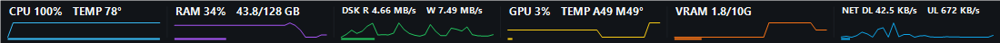

# Taskbar Monitor Enhanced

A lightweight Windows taskbar system monitor for live CPU, RAM, disk, network, GPU, VRAM and temperature telemetry.

## v1.1.3 — Startup Resilience

Version **v1.1.3** is a focused reliability release built on the accepted protected-sensor architecture. Its primary change is resilient **Start with Windows** behavior after the observed loss of the normal Windows Run registration.

When Start with Windows is enabled, v1.1.3 maintains two independent per-user launch registrations:

- the normal `HKCU\Software\Microsoft\Windows\CurrentVersion\Run\TaskbarMonitorEnhanced` entry for immediate launch;
- a `Taskbar Monitor Enhanced Startup Recovery.lnk` fallback in the current user's Startup folder, invoking a bounded `--startup-recovery` mode.

Either surviving path repairs the missing registration. The fallback waits up to 12 seconds for the primary launch path and exits early when it detects the primary process; the existing named mutex remains the final single-instance guard. Turning Start with Windows off removes both registrations.

The v1.1.3 qualification run also re-rendered **all 14 themes from live sampled telemetry** and checked both 592 px and 500 px compact layouts with zero recorded overflow.

Download the immutable release from:

https://github.com/GOD13emad/TaskbarMonitorEnhanced/releases/tag/v1.1.3

Release assets and hashes are published in `SHA256SUMS_v1.1.3.txt` and `RELEASE_MANIFEST_v1.1.3.json`.

### Preserved protected-sensor baseline

v1.1.3 intentionally reuses the exact accepted `1.1.2+r21` protected sensor layer when its hash and live-health compatibility gates pass. CPU/GPU/storage process isolation, watchdog supervision, suspend/resume handling, shell recovery, updater integrity checks, SBOM/provenance controls, and the established 14-theme renderer remain intact.

The public **v1.1.2** tag and assets remain immutable historical release evidence and are never retagged or overwritten.

## Install and uninstall

Install only from the official GitHub Releases page and verify the published SHA-256 values before running the installer.

The installer registers **Taskbar Monitor Enhanced** in Windows Installed apps and creates a per-user uninstaller at `%LOCALAPPDATA%\TaskbarMonitorEnhanced\Uninstall.exe`.

To uninstall, use either:

- **Windows Settings > Apps > Installed apps > Taskbar Monitor Enhanced > Uninstall**, or
- run `%LOCALAPPDATA%\TaskbarMonitorEnhanced\Uninstall.exe /uninstall`.

The application, shortcuts, both Start-with-Windows registrations, and its uninstall registration are removed by the project uninstaller. The PawnIO system component is intentionally not removed automatically because another hardware-monitoring application may depend on it.

## Reliability and validation

v1.1.3 retains the accepted protected-sensor architecture while adding resilient Start-with-Windows recovery. The current validation model covers:

- process-isolated CPU, GPU, and storage sensor workers with watchdog supervision
- bounded recovery, suspend/resume handling, and stale-data invalidation
- non-elevated main application with protected sensor repair only when required
- deterministic clean-clone builds with pinned dependency hashes
- SPDX SBOM generation and GitHub build-provenance/SBOM attestations
- immutable release/hash verification for automatic updates
- atomic configuration writes and bounded log retention
- all 14 live-data themes plus 592 px and 500 px compact-layout proofs
- startup fault-injection for missing primary/recovery registrations and duplicate-launch containment

The protected sensor binaries retain the accepted `1.1.2+r21` internal compatibility identity; that identifier is an implementation lineage marker, not the public application version.

See the [current v1.1.3 release notes](docs/releases/v1.1.3/RELEASE_NOTES.md), [v1.1.3 public acceptance](docs/acceptance/v1.1.3/PUBLIC_RELEASE_ACCEPTANCE.json), and [GitHub Releases](https://github.com/GOD13emad/TaskbarMonitorEnhanced/releases) for previous published versions.

## Visual gallery

Representative v1.1.3 live-rendered theme:

All 14 themes, re-rendered by the real v1.1.3 application with live sampled metrics during release qualification:

These images are renderer evidence from the application itself, not synthetic UI mockups. See the [full screenshot gallery](docs/screenshots/README.md) for individual theme and compact-layout proofs.

## Code signing policy

The immutable **v1.1.2** release remains the accepted historical unsigned baseline and is not rewritten after publication. **v1.1.3 is also published unsigned unless a publicly trusted provider has actually issued and applied a production certificate before release.** Windows may therefore show **Unknown publisher**.

Public-trust signing status: **SignPath Foundation application readiness is prepared; project acceptance and production signing are still pending.** No release is claimed to be signed by SignPath Foundation without verifiable Authenticode evidence.

**Free code signing provided by SignPath.io, certificate by SignPath Foundation.** This provider statement describes the intended open-source signing path and becomes an actual release-signature claim only after SignPath Foundation accepts the project and signs a release artifact.

See the project [Code signing policy](CODE_SIGNING.md) for roles, release-origin controls, approval rules, and signature verification. See [PRIVACY.md](PRIVACY.md) for the exact GitHub update-check network behavior.

The local self-signed development certificate is used only to validate the Authenticode pipeline; it is not a publicly trusted publisher certificate. A future publicly signed build must still pass the full build, runtime, SBOM, provenance, hash, and release acceptance gates before publication.

## Why this project exists

Taskbar Monitor Enhanced is designed to feel like part of Windows rather than a separate monitoring application: compact enough to leave running all day, useful at a glance, customizable without being distracting, and resilient when the Windows shell restarts.

## Highlights

- CPU, RAM, disk, GPU, VRAM, upload and download monitoring
- CPU Package / vendor-neutral CPU temperature telemetry
- AMD Radeon GPU temperature fallback through AMD ADLX 1.1 when LibreHardwareMonitor does not expose an AMD GPU temperature sensor
- NVIDIA, AMD, and Intel GPU telemetry paths
- 14 built-in themes
- live sparklines and theme-aware network graphs
- left, center, and right taskbar placement
- compact taskbar rendering with vertical DL/UL stacking in narrow Network cards
- direct left-click and right-click interaction without click-through behavior
- no-activate taskbar interaction
- stable Start/Search/taskbar placement and persistent shell-style self-heal
- automatic Explorer/taskbar recovery
- non-elevated main application
- protected hardware-sensor broker with watchdog supervision
- self-healing Start-with-Windows support with independent primary and recovery registrations
- Desktop and Start Menu shortcuts
- upgrade, uninstall, clean-install, and post-install runtime validation

## Documentation languages

English is the primary project language. Short user-facing documentation is also available in:

- [فارسی / Persian](docs/i18n/README.fa.md)
- [中文 / Simplified Chinese](docs/i18n/README.zh-CN.md)
- [हिन्दी / Hindi](docs/i18n/README.hi.md)
- [Español / Spanish](docs/i18n/README.es.md)
- [Français / French](docs/i18n/README.fr.md)
- [العربية / Arabic](docs/i18n/README.ar.md)
- [বাংলা / Bengali](docs/i18n/README.bn.md)
- [Português / Portuguese](docs/i18n/README.pt.md)
- [Русский / Russian](docs/i18n/README.ru.md)
- [اردو / Urdu](docs/i18n/README.ur.md)
- [Bahasa Indonesia / Indonesian](docs/i18n/README.id.md)

## Project authorship

**Lead Developer & Maintainer:** Dr. Ali-Akbar Emadeddin  
Email: `aliemad1324@gmail.com`  
GitHub: `GOD13emad`

Taskbar Monitor Enhanced is derived from the open-source `leandrosa81/taskbar-monitor` project. Upstream authorship, attribution, and GPL licensing are preserved.

AI-assisted tools were used during development for code drafting, refactoring, diagnostics, test scaffolding, documentation, and iterative review. Requirements, architecture, hardware validation, acceptance testing, and release responsibility remained under human control.

## License

GNU General Public License v3.0.

See `LICENSE`, `COPYRIGHT_AND_ATTRIBUTION.md`, and `THIRD_PARTY_NOTICES.md` for details.
