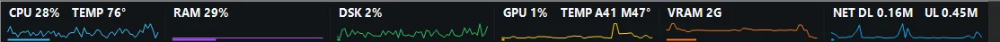
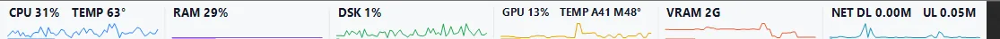
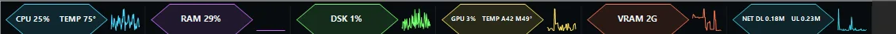
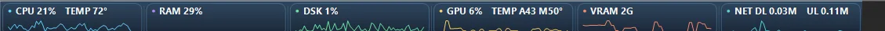
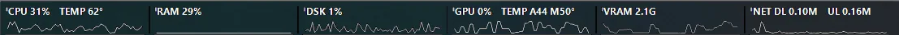
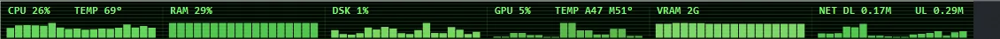

# Screenshot Gallery

These are real screenshots from Windows 11 running Taskbar Monitor Enhanced on an everyday desktop. I kept the full desktop view here because it shows the part that matters most: the monitor actually lives inside the taskbar instead of floating in a separate window.

## Real desktop view

## Taskbar theme previews

### Dark Minimal

### Sleek White

### Honeycomb Tech

### Fluent Glass

### OLED Mono

### Retro Terminal

The screenshots use live machine data, so percentages, temperatures, traffic rates, and graph shapes naturally differ between captures.

The application includes 14 built-in themes in total. More real-world captures will be added here over time without replacing the original release evidence.
