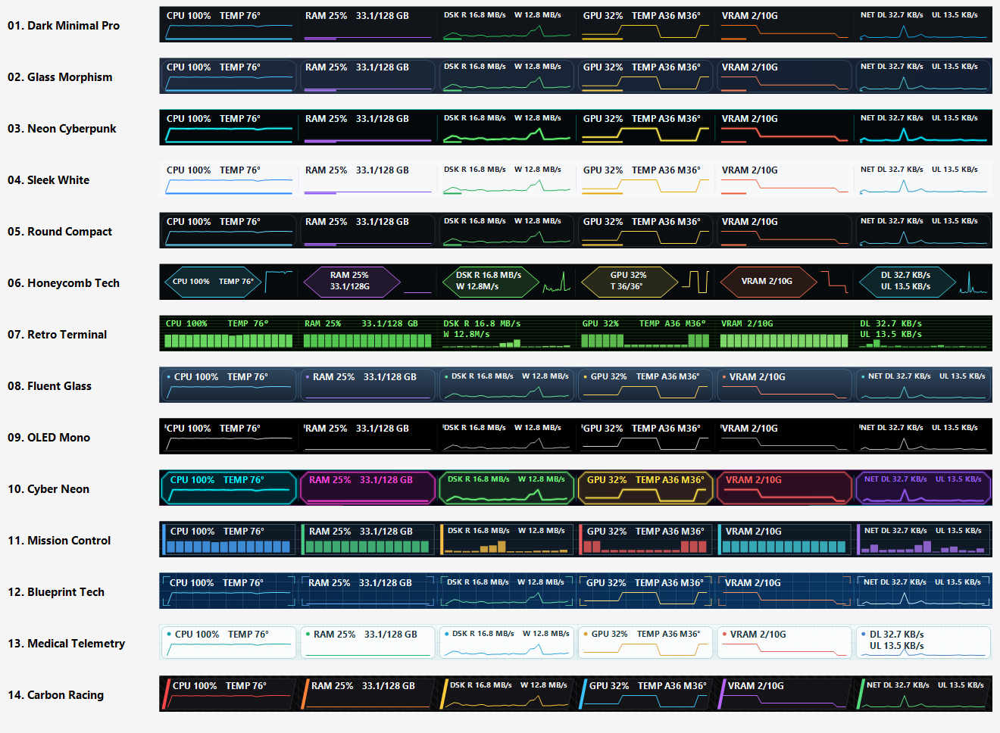

# Screenshot Gallery

These images were captured from Taskbar Monitor Enhanced running on Windows 11 during the final validation and release-preparation work. They are real application captures, not generated UI mockups.

## Full desktop capture

## Theme strips

### Dark Minimal

### Sleek White

### Honeycomb Tech

### Fluent Glass

### OLED Mono

### Retro Terminal

The application ships with 14 themes in total. This gallery intentionally keeps the repository landing page compact while showing representative light, dark, technical, glass, OLED, and terminal styles.
## Final R21 all-theme proof

This contact sheet was generated by the real v1.1.2-rc10 renderer using live sampled metrics (NoSyntheticMetricData=true; 30 live samples), immediately before final v1.1.2 identity derivation. All 14 themes were also checked at 592 px and 500 px; compact proof recorded zero overflow.

Individual full-width proof images are in [docs/screenshots/themes](themes/). These renderer proofs complement the real Windows desktop/taskbar captures above; they are not decorative mockups.