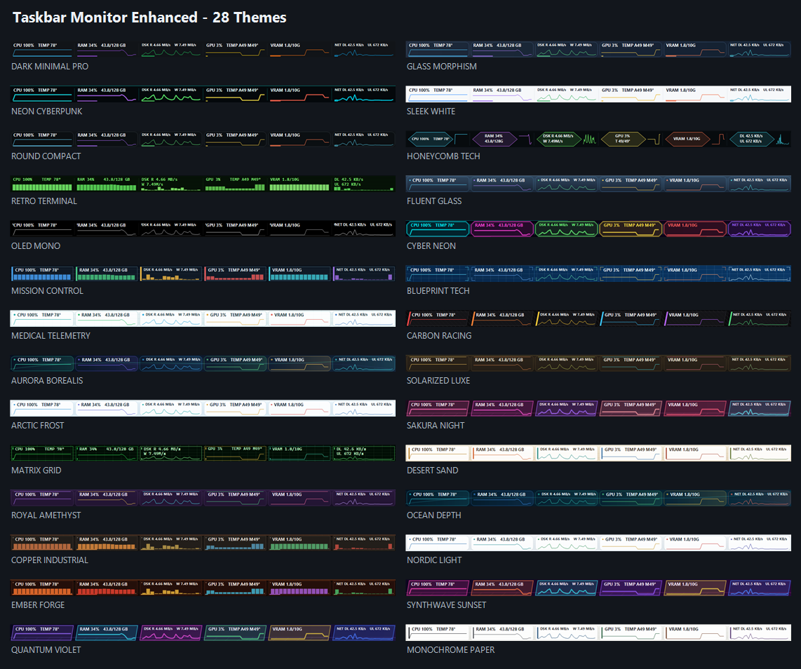
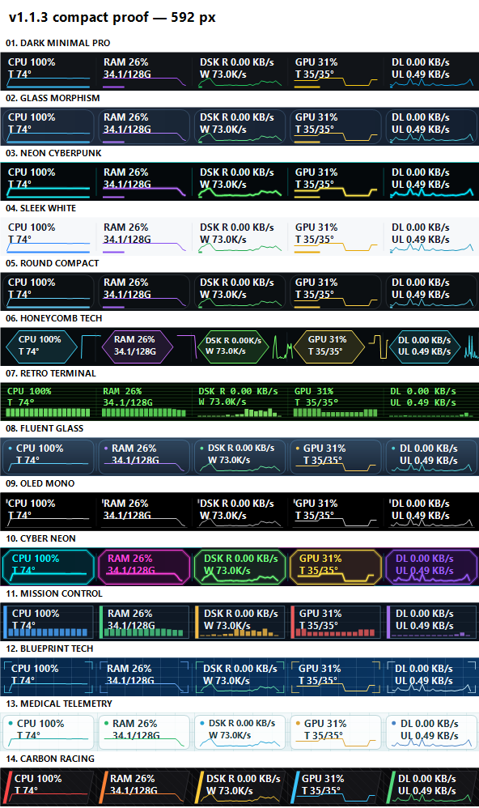
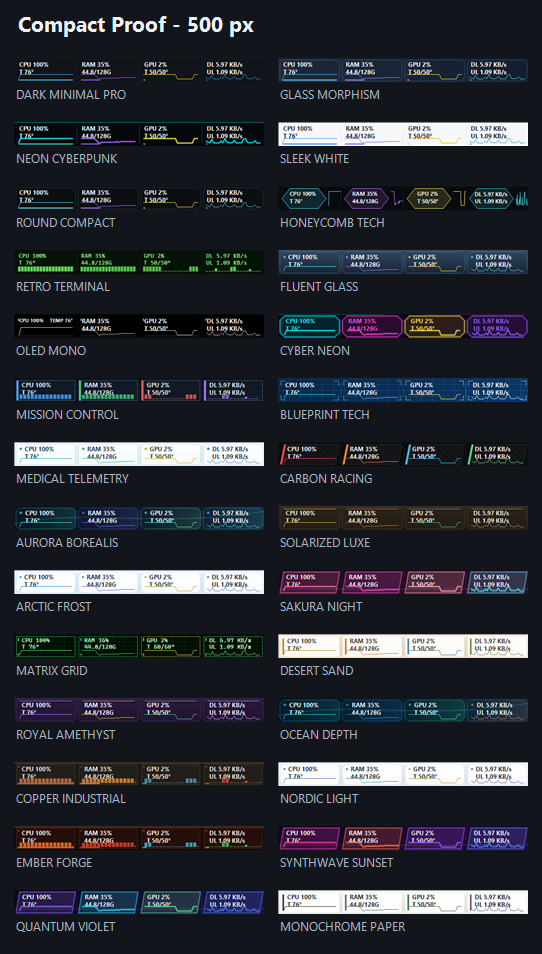

# Screenshot and renderer evidence

These images are generated by Taskbar Monitor Enhanced itself. The Settings gallery has been refreshed from the installed v1.4.0 R35 build using a real shown-and-painted Settings form. The Display page uses the actual taskbar renderer with live sampled telemetry and no synthetic metric data, and the proof manifest records PerMonitorV2 DPI, zero accessibility-name gaps and zero High Contrast style gaps. Theme and compact renderer families remain regression-qualified.

## 9-page Settings

All nine Settings pages and the machine-readable manifest are in [`settings/`](settings/): Display, Metrics, Alerts, Hardware, Units, Behavior, Updates, Diagnostics and Advanced.

## 28-theme live proof

The renderer sampled live telemetry and produced all 28 theme strips with `NoSyntheticMetricData=true`.

Individual theme images and `THEME_PROOF_MANIFEST.json` are in [`themes/`](themes/).

## Compact-layout proof

The compact proof covers all 28 themes at 592 px and 500 px with zero overflow.

### 592 px

### 500 px

`COMPACT_PROOF_MANIFEST.json` records the machine-readable compact qualification.

## Evidence status

These are renderer/UI evidence, not synthetic marketing mockups. The v1.4.0 Settings proof records `ACTUAL_TASKBAR_RENDERER`, 48 px preview height, 12 live samples, `DpiAwareness=PerMonitorV2`, `AccessibilityNameGaps=0`, and `HighContrastStyleGaps=0`.
